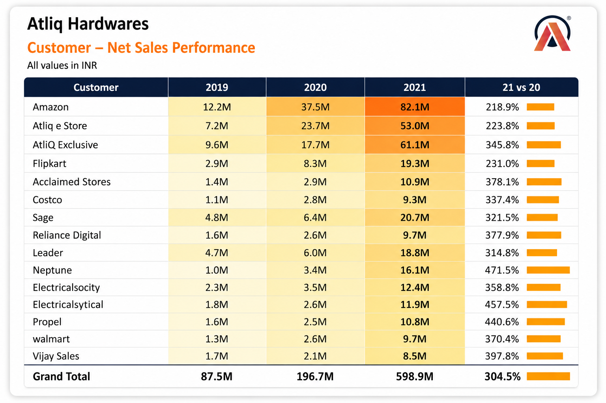

<h1 align="center">📊 Excel Sales Analytics Dashboard | Business Intelligence Solution</h1>

End-to-end Excel analytics solution for Sales & Finance reporting using Power Query, Power Pivot, and DAX.

  

---

## 🔍 Project Overview

This project showcases how Excel can be leveraged as a scalable analytics platform by automating reporting workflows and delivering actionable business insights.

It integrates customer performance, market analysis, and financial reporting into a unified, decision-ready dashboard.

---

💡 **Impact:** 

Reduced manual reporting effort, improved reporting accuracy, and enabled faster, data-driven decision-making through centralized analytics.

---

## 📊 Dashboard Preview

  

---

## 🎯 Business Problem

AtliQ required a structured reporting system to:

* Monitor customer performance
* Compare market performance against sales targets
* Analyze profitability across markets and time

Manual Excel reporting was fragmented, time-consuming, and lacked scalability.

---

## 💡 Solution

Built an end-to-end Excel analytics solution using Power Query, Power Pivot, and DAX to automate data transformation, modeling, and reporting.

---

## 📈 Key Features

### 📊 Sales Analytics

* Customer performance reporting
* Market vs target comparison
* KPI tracking and trend analysis
* Identification of high-growth markets

### 💰 Finance Analytics

* Profit & Loss (P&L) by Fiscal Year and Month
* Market-level profitability insights
* Financial benchmarking and trend evaluation

---

## 🛠️ Tools & Techniques

* Microsoft Excel
* Power Query (ETL & Data Transformation)
* Power Pivot (Data Modeling)
* DAX (Calculated Columns & Metrics)
* PivotTables & PivotCharts

---

## 📄 Reports & Outputs

### 📊 Sales Reports

* 📄 [Customer Performance Report](reports/customer-performance-report.pdf)
* 📄 [Market vs Target Analysis](reports/market-vs-target-report.pdf)

### 💰 Finance Reports

* 📄 [P&L Statement by Fiscal Year](reports/pnl-by-fiscal-year.pdf)
* 📄 [P&L Statement by Markets](reports/pnl-by-markets.pdf)
* 📄 [P&L Statement by Months](reports/pnl-by-months.pdf)

---

## 🧠 Business Impact

* Reduced manual reporting effort through automation
* Enabled faster decision-making with structured dashboards
* Improved visibility across sales and financial performance
* Supported strategic planning with KPI-driven insights

---

## 🚀 Key Takeaways

* Excel can function as a full analytics tool with proper modeling
* ETL + Data Modeling significantly improve reporting workflows
* Business insights come from structured analysis, not just visuals

---

## 🤝 Connect With Me

- 🌐 LinkedIn: [Asim Ahmed](https://www.linkedin.com/in/asimahmedio)  
- 💻 GitHub: [asimahmedio](https://github.com/asimahmedio)  
- ✉️ Email: **asim.atia@gmail.com**
